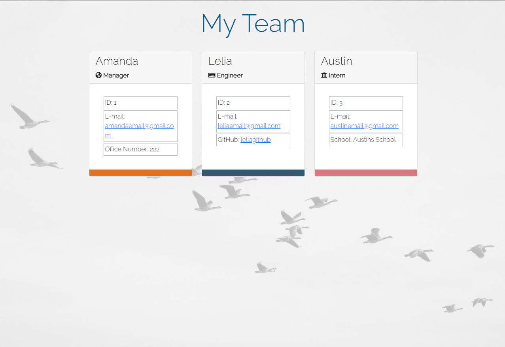

  
  

  
  
  ---

  ## **Description**
    
  Every good project has a team working together behind it. This Command Line Interface app aims to be a useful tool for teams to keep track of contact information and roles for each team-member to easily access in one location. The design inspiration comes from a desire for a clean space, and the reminder that groups shine best when teamwork is implemented and each team member gets to exhibit their skills, much like geese in an alternating flying pattern.

  The CLI keeps it simple for the user to just answer a few information prompts, and the app does the rest. Teams will have a sleek, useful page in no time.
  
  ---
  
  ## Table of Contents  
  
  - [Description](#Description)  
  - [Installation](#Installation)
  - [Usage](#Usage)
  - [Test Instructions](#Tests)
  - [Contributions](#Contributions)
  - [License](#License)
  - [Questions & Contact](#Questions)
  
  
  ---
  
  ## **Installation**
  
  The user should install the following in their terminal in order for the application to run properly:  

  - npm install 
  - npm intall inquirer
  - npm install cheerio
  - npm install open
  
  ---
  
  ## **Usage**
  
  Upon installation, the user will open the application by entering 'node index.js' in the terminal. This will trigger a prompt & response form, where the user should answer the prompts accordingly. Once the prompt is complete, an html file titled 'Team-Profiles.html' is saved in the 'outputs' directory. This html file will have all the information that was put in the prompt displayed on an attractive page in the browser.  

  The demo video linked below walks through the installation process, running tests, and using the application.  

  Demo Video: [https://drive.google.com/file/d/1VLNfxSN_ahHg1eBlQnavamKWFup35U_Y/view]  

  Screenshot of demo file:  
  
  
  
  ---
  
  ## **Tests**
  
  npm jest was used to test this application. All tests have passed. 
  
  ---

  ## **Contributions**
  
  Thanks to help and advice from Austin Ruhf
  
  ---

  ## **License**

   

  This application is covered under the licensing rules from MIT
  

  ## Questions 
  
  [GitHub](https://www.github.com/awiehrs)
    
  
  Send me an e-mail at: alwiehrs@gmail.com  

